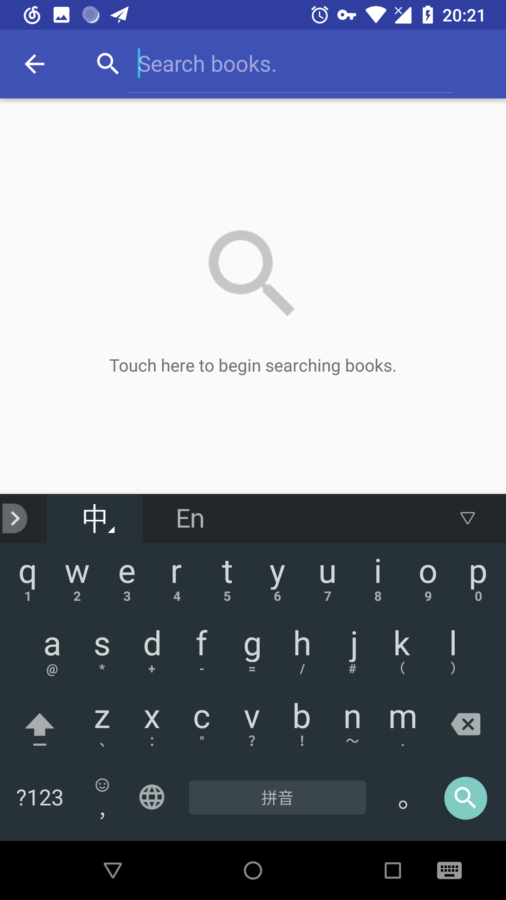
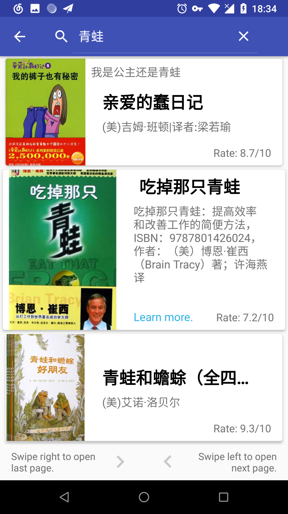
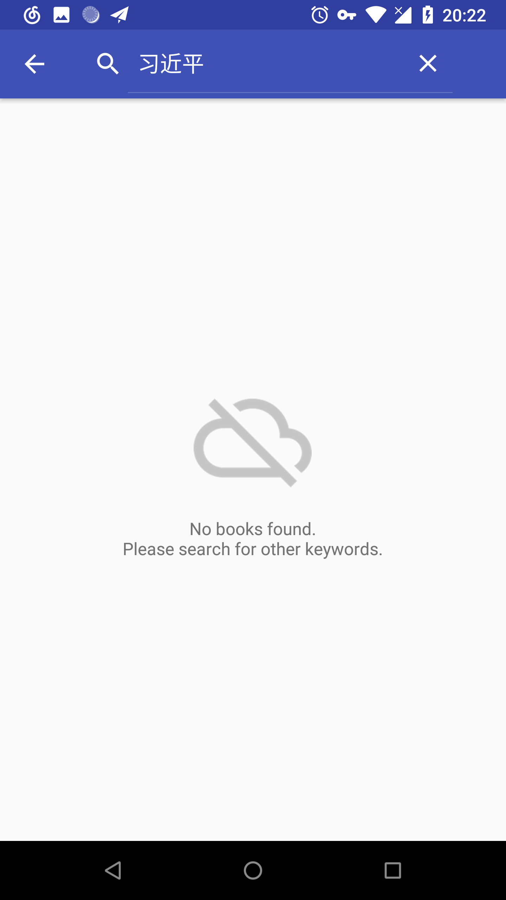

01/28/18: Initiate Commit.

This project is an Android App which is a book search tool using [DOUBAN](https://developers.douban.com/wiki/?title=book_v2) API.

 

Users can touch the empty state `TextView` to open `SearchView` in AppBar and enter keywords.

Users get their results displayed in a list of expandable `CardView` in `RecyclerView`, along with the total number of books that the app found, and the page info including the current page and the total page number.  
In each book card, it displays the title, subtitle, author, rate(or no rate) and an image of the book, when the card is collapsed by default. Once users touch the card, it will expand vertically and a bit horizontally, and hide the subtitle and author of the book, making room for the summary of the book. Furthermore, at the left bottom corner of the card, there is a "Learn more" string that supports intent the browser with the DOUBAN URL of the book when users click it.  
The app will display texts first, then the images, in order to get a faster experience. So there are two `AsynctaskLoader`, one for text loading, the other for image loading.

 

When there are more than ten books result, users can navigate through pages by swiping left or right at the bottom of the list. There is some kind of swipe feedback to both left and right gestures. And of course, when the app is at the first page, it will not tell users to swipe right to go back to the previous page; and when the app is at the last page, it will also not tell users to swipe left to the next page.

The app saves necessary states in `onSaveInstanceState` and retrieve them in `onCreate`, when users rotate their device or similar situations, so it can maintain the list of books when there is one.

The app use `SwipeRefreshLayout` as the loading indicator, and when there are contents in the list, it supports "Pull to Refresh" gesture which will refresh the current page's contents. More information in this CodePath [link](https://guides.codepath.com/android/Implementing-Pull-to-Refresh-Guide).

 

When the device is not connected to Internet or no result found from the API, the app will display the right empty state view to users.

This is a training project in Udacity's Android Basics Nanodegree program.  
Check out this and other courses here: https://www.udacity.com/courses/all
